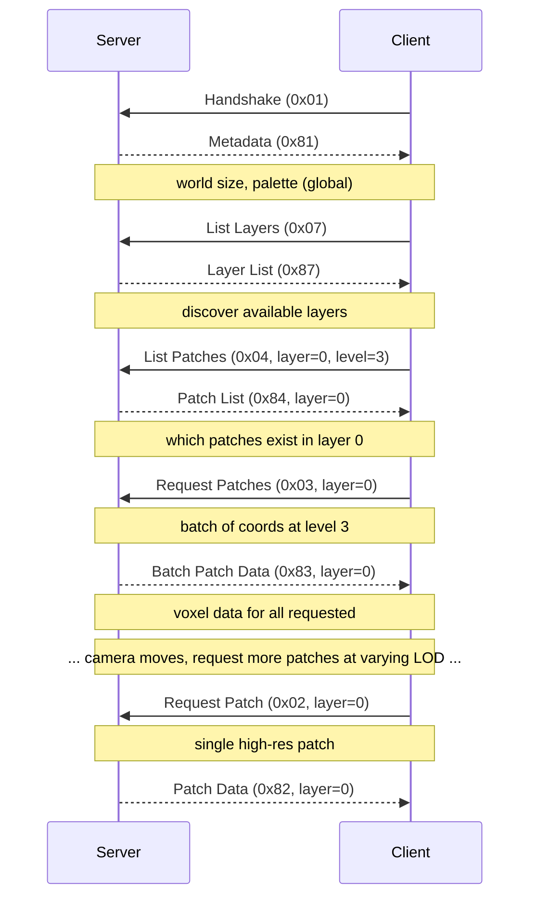
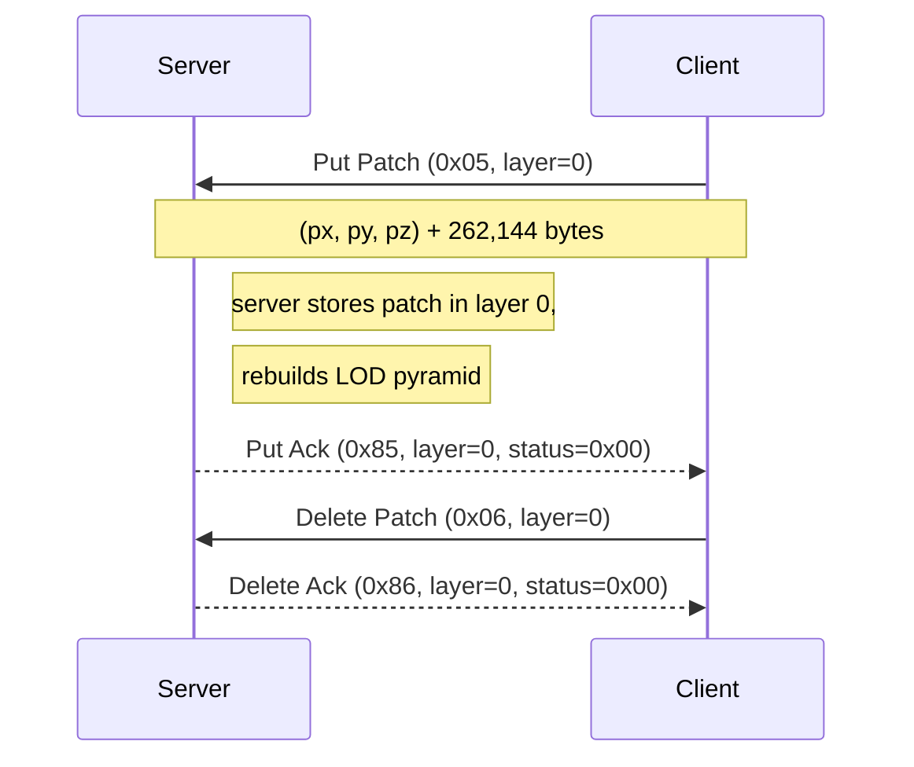

# Voxel WebSocket Binary Protocol

## 1. Overview

Binary protocol over WebSocket for streaming voxel patch data between client and server.

- **Transport**: WebSocket binary frames
- **Byte order**: little-endian throughout
- **Default port**: 9876 (configurable)
- **Common header**: every message starts with `[1B type][4B request_id][payload...]`

The `request_id` is set by the client and echoed back by the server, allowing responses to be matched to requests.

### 1.1 Layers

All patch-scoped messages include a `layer` field (u32) immediately after the common header. Layers are generic namespaces that can represent semantic world layers (terrain, buildings, foliage), simulation time frames, data channels, or any other partitioning of voxel data. The server stores data as `db[layer][patch.xyz][lodlvl]`.

Metadata (world size, palette, max LOD level) is global and shared across all layers.

## 2. Read Protocol

### 2.1 Client -> Server

| Type | Name | Payload |
|------|------|---------|
| `0x01` | Handshake | *(none)* |
| `0x02` | Request Patch | `[4B layer][1B level][4B px][4B py][4B pz]` |
| `0x03` | Request Patches | `[4B layer][2B count][count * (1B level, 4B px, 4B py, 4B pz)]` |
| `0x04` | List Patches | `[4B layer][1B level]` |
| `0x07` | List Layers | *(none)* |

- **Handshake**: initiates the connection; server responds with Metadata.
- **Request Patch**: fetch a single patch at the given LOD level and grid coordinates within the specified layer.
- **Request Patches**: batch request for multiple patches in one message. All patches in a batch belong to the same layer. Each entry is 13 bytes (1B level + 3*4B coords).
- **List Patches**: list all non-empty patches at the given LOD level within the specified layer.
- **List Layers**: list all layers that currently contain data.

### 2.2 Server -> Client

| Type | Name | Payload |
|------|------|---------|
| `0x81` | Metadata | `[4B size_x][4B size_y][4B size_z][1B max_level][1B palette_count][N * 3B RGB]` |
| `0x82` | Patch Data | `[4B layer][1B level][4B px][4B py][4B pz][1B encoding][data]` |
| `0x83` | Batch Patch Data | `[4B layer][2B count][count * patch_data]` |
| `0x84` | Patch List | `[4B layer][2B count][count * (4B px, 4B py, 4B pz)]` |
| `0x87` | Layer List | `[2B count][count * 4B layer]` |
| `0xFF` | Error | `[2B code][UTF-8 message]` |

- **Metadata**: world dimensions in patches, maximum LOD level, and color palette. `palette_count` gives N (max 255), followed by N * 3-byte RGB entries. Metadata is global (shared across all layers).
- **Patch Data**: voxel data for a single patch. See §2.3 for encodings.
- **Batch Patch Data**: multiple patches in one message, all from the same layer. Each `patch_data` entry has the same layout as Patch Data's payload (level + coords + encoding + data), concatenated with no padding.
- **Patch List**: coordinates of all non-empty patches at the requested level within the specified layer.
- **Layer List**: all layer IDs that currently contain data.
- **Error**: numeric error code and a UTF-8 error description.

### 2.3 Encodings

| Value | Name | Data |
|-------|------|------|
| `0` | Empty | No data bytes (patch is entirely empty) |
| `1` | Dense | Raw `(2^level)^3` bytes, x-fastest iteration order |

Dense encoding stores voxels as a flat byte array. For a level-6 patch (64^3), this is 262,144 bytes. Iteration order is x-fastest (x increments first, then y, then z):

```
for z in 0..size:
  for y in 0..size:
    for x in 0..size:
      byte = data[z * size * size + y * size + x]
```

### 2.4 Typical Flow



## 3. Write Protocol

The write protocol allows clients to push voxel data to the server. Writes are always at full resolution (64^3, level 6). The server recomputes the LOD pyramid internally after receiving a write.

### 3.1 Client -> Server

| Type | Name | Payload |
|------|------|---------|
| `0x05` | Put Patch | `[4B layer][4B px][4B py][4B pz][1B encoding][data]` |
| `0x06` | Delete Patch | `[4B layer][4B px][4B py][4B pz]` |

- **Put Patch**: write a full-resolution 64^3 patch to the specified layer. No `level` field — writes are always level 6. Encoding must be `1` (dense); use Delete Patch instead of sending an empty patch.
- **Delete Patch**: remove a patch and all its LOD levels from the specified layer.

### 3.2 Server -> Client

| Type | Name | Payload |
|------|------|---------|
| `0x85` | Put Ack | `[4B layer][4B px][4B py][4B pz][1B status]` |
| `0x86` | Delete Ack | `[4B layer][4B px][4B py][4B pz][1B status]` |

Status codes:
- `0x00` — success
- `0x01` — error (details in a separate Error message if needed)

### 3.3 Write Flow



### 3.4 Design Notes

- No `level` field on writes — always full resolution (64^3 bytes = 256 KB). The server is responsible for building coarser LOD levels.
- Only dense encoding (1) is valid for Put Patch. Encoding 0 (empty) is not meaningful — use Delete Patch to remove data.
- The server should rebuild the LOD pyramid (levels 0 - 5) from the written level-6 data before sending the ack.

## 4. Data Types Reference

### Voxel Byte
- `0x00` = empty (air)
- `0x01` - `0xFF` = palette color index (see Metadata message for palette)

### Patch
- A cube of 64^3 voxels
- Identified by integer grid coordinates `(px, py, pz)` within a layer
- World position derived as `patch_coord * 64 * resolution`

### LOD Levels

| Level | Resolution | Voxels | Dense Size |
|-------|-----------|--------|------------|
| 0 | 1^3 | 1 | 1 B |
| 1 | 2^3 | 8 | 8 B |
| 2 | 4^3 | 64 | 64 B |
| 3 | 8^3 | 512 | 512 B |
| 4 | 16^3 | 4,096 | 4 KB |
| 5 | 32^3 | 32,768 | 32 KB |
| 6 | 64^3 | 262,144 | 256 KB |

LOD levels are only relevant for reads. Writes always operate at level 6 (full resolution).

### Integer Types
- Coordinates (`px`, `py`, `pz`, `size_x`, `size_y`, `size_z`): signed 32-bit LE (`i32`)
- Layer (`layer`): unsigned 32-bit LE (`u32`)
- Counts (`count`): unsigned 16-bit LE (`u16`)
- `request_id`: unsigned 32-bit LE (`u32`)
- `type`, `level`, `encoding`, `status`, `palette_count`: unsigned 8-bit (`u8`)
- Error `code`: unsigned 16-bit LE (`u16`)

### Type Code Summary

| Code | Direction | Name |
|------|-----------|------|
| `0x01` | Client -> Server | Handshake |
| `0x02` | Client -> Server | Request Patch |
| `0x03` | Client -> Server | Request Patches |
| `0x04` | Client -> Server | List Patches |
| `0x05` | Client -> Server | Put Patch |
| `0x06` | Client -> Server | Delete Patch |
| `0x07` | Client -> Server | List Layers |
| `0x81` | Server -> Client | Metadata |
| `0x82` | Server -> Client | Patch Data |
| `0x83` | Server -> Client | Batch Patch Data |
| `0x84` | Server -> Client | Patch List |
| `0x85` | Server -> Client | Put Ack |
| `0x86` | Server -> Client | Delete Ack |
| `0x87` | Server -> Client | Layer List |
| `0xFF` | Server -> Client | Error |
